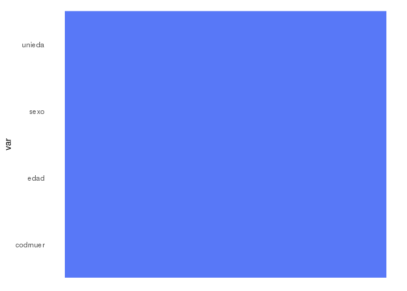
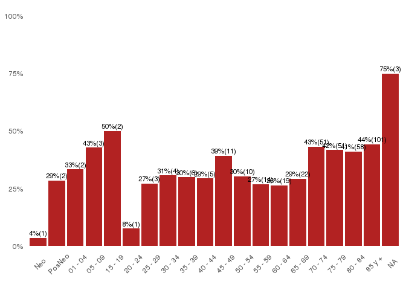

deistools
================

deistools
=========

deistools es un paquete que simplifica la realización de tareas habituales de las áreas de bioestadística.

Instalación:

``` r
install.packages(c('devtools','tidyverse','readxl','stringr'))
devtools::install_github('diegogarcilazo/deistools')
```

### Funciones de Chequeo

El paquete deistools tiene incorporadas funciones para validar la información de las bases de mortalidad generadas por la DEIS. El primer grupo de validaciones son aquellas utilizadas para el control y reparación de la información.

Las validaciones utilizadas se las divide en 6 indicadores:

Errores (errors) \*:

-   **Asterisco:** Son codigos válidos como códigos adicionales pero no se aceptan como causa básica de muerte(CBM).
-   **No CBD:** Código que no es válido como CBM.
-   **Limitado** a un sexo: restricción del código asociado al género.
-   **Límite de edad:** código limitado a un rango de edad.

Alertas (warnings)\*:

-   **Trivial:** Son condiciones poco probables como causa de muerte.
-   **SMD:** sospecha de muerte materna.

\* Fuente de información: Se utilizó la tablas sugeridas por <http://www.paho.org/hq/index.php?option=com_docman&task=doc_download&gid=23700&Itemid=270&lang=en>

Crear instancia
---------------

La `checkCie10$new(args)` crea el objeto de clase checkCie10 que nos permitirá utilizar los métodos de chequeo. Se debe iniciar con los datos de edad, unidad de la edad, código de muerte, sexo y las variables que consideremos de identificación de los registros.

``` r
suppressMessages(library(tidyverse))
library(deistools)

chequeo <- checkCie10$new(deistools::test_df, edad, unieda, codmuer, sexo, id)
```

    ## Warning in deistools::rec_age2day(as.numeric(~edad), ~unieda): There are
    ## age equals 0 will be coerced to 1

    ## ------------------------------------------------------------------
    ## Dataset = deistools::test_df
    ## rows = 1000
    ## 
    ## ------------------------------------------------------------------
    ## Indicators:
    ## ------------------------------------------------------------------
    ## Errors:
    ##   1. Age limit: Out of Age limit accepted.
    ##   2. Asterisk: are valid only as additional codes.
    ##   3. Limited to one sex: Restriction codes associated with gender.
    ##   4. No CBD: It is not valid as a Basic Cause of Death.
    ## 
    ## Warnings:
    ##   5. SMD: Suspected Maternal Death.
    ##   6. Trivial: conditions unlikely to cause death.
    ##   7. Useless Codes
    ## 
    ## ------------------------------------------------------------------
    ## list methods:
    ## ------------------------------------------------------------------
    ##   list_problems(). To list certificates problems.
    ##   list_enos(). Check for Notifiable infectous diseases.
    ##   list_unknown(). Check for unknown categories.
    ##   list_all(). list all vars.
    ## 
    ## ------------------------------------------------------------------
    ## plot methods:
    ## ------------------------------------------------------------------
    ##   plot_missing(). raster by missing status.
    ##   plot_useless(). Plot % of useless code by group age.
    ## ------------------------------------------------------------------

Métodos para generar listas.
----------------------------

**list\_problems**: Lista los certificados con problemas (errores y/o warnings)

``` r
chequeo$list_problems()
```

**list\_enos**: Lista los certificados con códigos de enfermedades de notificación obligatoria.

``` r
chequeo$list_enos()
```

**list\_unknown**: Lista los certificados con problemas (errores y/o warnings)

``` r
chequeo$list_unknown()
```

**list\_all**: Lista todos los certificados.

``` r
chequeo$list_all()
```

Métodos para generar gráficos.
------------------------------

**plot\_missing**: crear un gráfico de raster rellenando con color aquellos registros con datos y dejando en blanco los NA.

``` r
chequeo$plot_missing()
```



**plot\_useless**: crea un gráfico d barras con el porcentaje de códigos poco útiles por grupos de edad.

``` r
chequeo$plot_useless()
```


